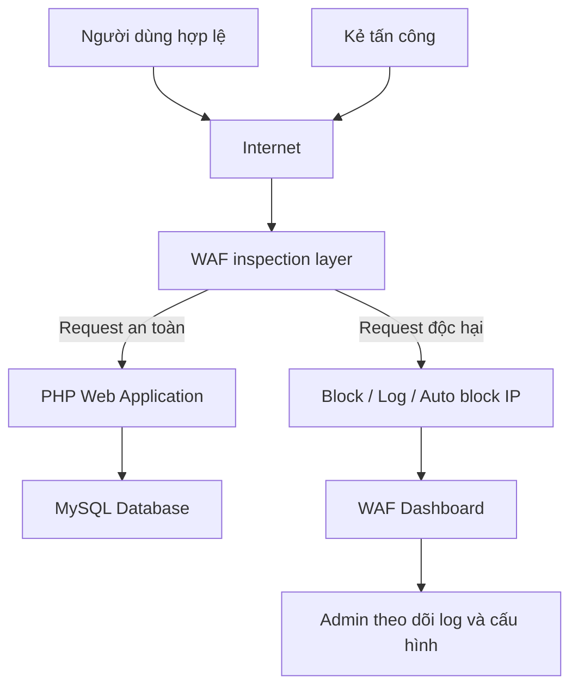
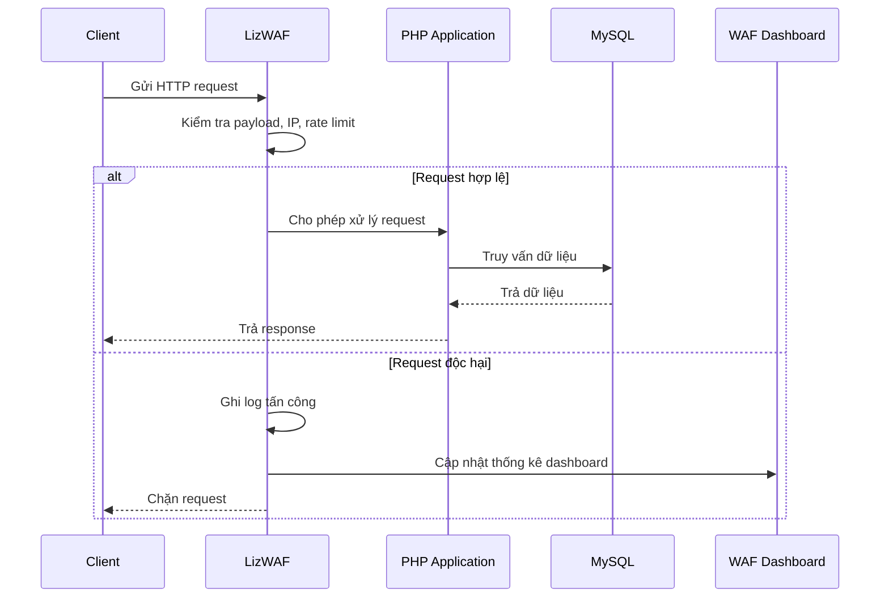

# Cloud WAF Security Demo

Một dự án minh họa cơ chế bảo vệ ứng dụng web triển khai trên môi trường Internet/cloud bằng Web Application Firewall (WAF). Dự án sử dụng PHP, MySQL và một website thương mại điện tử mẫu để mô phỏng cách WAF kiểm tra request, phát hiện tấn công, ghi log, giới hạn truy cập và chặn IP độc hại.

> Chủ đề liên quan: Tìm hiểu về điện toán đám mây và vấn đề an ninh an toàn trong điện toán đám mây.

## Giới Thiệu

Trong môi trường điện toán đám mây, các ứng dụng web thường được triển khai công khai qua Internet. Điều này giúp người dùng truy cập dễ dàng, nhưng đồng thời làm tăng nguy cơ bị tấn công qua HTTP request, form nhập liệu, URL parameter hoặc API endpoint.

Dự án này mô phỏng một lớp bảo vệ nằm trước ứng dụng web. Lớp bảo vệ đó kiểm tra request trước khi ứng dụng xử lý, tương tự vai trò của các dịch vụ như AWS WAF, Azure Web Application Firewall hoặc Google Cloud Armor.

Mục tiêu của demo:

- Minh họa cách một ứng dụng web cloud-facing có thể bị tấn công.
- Mô phỏng lớp WAF bảo vệ ứng dụng trước các payload phổ biến.
- Cho thấy quá trình ghi log, thống kê, chặn IP và quản trị cấu hình WAF.
- Liên hệ trực tiếp với nội dung an ninh an toàn trong điện toán đám mây.

## Demo Trực Tuyến

Dự án đã được triển khai để người dùng có thể truy cập và kiểm thử trực tiếp:

```text
https://lizamort1.lovestoblog.com/
```

Link demo:

[https://lizamort1.lovestoblog.com/](https://lizamort1.lovestoblog.com/)

Người đánh giá có thể sử dụng bản triển khai này để kiểm tra luồng truy cập bình thường, thử các payload tấn công trong phần kịch bản demo và quan sát cách WAF ghi nhận hoặc chặn request độc hại.

## Tính Năng Chính

### Ứng dụng web mẫu

- Trang chủ hiển thị sản phẩm.
- Danh sách sản phẩm và chi tiết sản phẩm.
- Đăng ký, đăng nhập người dùng.
- Giỏ hàng và thanh toán mô phỏng.
- Khu vực quản trị sản phẩm, đơn hàng và người dùng.

### Web Application Firewall

- Bật hoặc tắt WAF từ dashboard quản trị.
- Phát hiện và chặn SQL Injection.
- Phát hiện và chặn Cross-Site Scripting (XSS).
- Phát hiện và chặn Command Injection.
- Phát hiện và chặn Path Traversal hoặc truy cập file nhạy cảm.
- Mô phỏng DDoS và rate limiting theo IP.
- Phát hiện lưu lượng bất thường theo số lượng request toàn cục.
- Tự động chặn IP khi vượt ngưỡng rủi ro.
- Quản lý danh sách IP bị chặn.
- Quản lý whitelist cho IP tin cậy.
- Ghi log payload, IP, loại tấn công, URI, method và user agent.
- Dashboard thống kê số lượng tấn công theo loại và thời gian.

### Các Loại Tấn Công Được Demo

| Payload kiểm thử | Phân loại | Ý nghĩa |
| --- | --- | --- |
| `rrrrrrrrrr%'; UPDATE products SET price = 10, sale_price = 10 WHERE id = 1; #` | SQL Injection | Cố gắng chèn câu lệnh SQL để cập nhật giá sản phẩm trong bảng `products`. |
| `file:includes/db.php` | Path Traversal / Local File Inclusion | Cố gắng truy cập file cấu hình nhạy cảm của ứng dụng bằng tiền tố `file:`. |
| `<script>alert('Bạn đã bị hack!')</script>` | Cross-Site Scripting (XSS) | Cố gắng chèn JavaScript vào input để trình duyệt thực thi mã độc. |
| Nhiều request liên tục tới `ddos_target.php` | DDoS / Rate Limiting | Mô phỏng truy cập tần suất cao để kiểm tra cơ chế giới hạn request. |
| `; whoami` hoặc `| whoami` | Command Injection | Cố gắng nối thêm lệnh hệ điều hành vào input. |
| `../../etc/passwd` | Path Traversal | Cố gắng đi ngược thư mục để đọc file hệ thống. |

## Kiến Trúc Tổng Quan

Dự án không xây dựng một nền tảng cloud hoàn chỉnh. Thay vào đó, dự án tập trung vào một thành phần bảo mật quan trọng trong cloud security: lớp WAF bảo vệ ứng dụng web công khai.



### Luồng xử lý request



## Cài Đặt

### Yêu cầu hệ thống

- PHP 8.0 hoặc mới hơn.
- MySQL hoặc MariaDB.
- Apache, khuyến nghị dùng XAMPP khi chạy local.
- Git.
- Trình duyệt web hiện đại.

### Clone dự án

```bash
git clone https://github.com/<username>/<repository>.git
cd <repository>
```

Nếu chạy bằng XAMPP, đặt thư mục dự án trong `htdocs`:

```text
C:\xampp\htdocs\cloud-waf-security-demo
```

Hoặc trên máy hiện tại:

```text
D:\TaiLieu\Kỳ 2 Năm 3\An toàn hệ điều hành\htdocs
```

### Tạo database

Tạo database MySQL:

```sql
CREATE DATABASE demo_shop CHARACTER SET utf8mb4 COLLATE utf8mb4_unicode_ci;
```

Import dữ liệu mẫu nếu có file dump:

```bash
mysql -u root -p demo_shop < assets/jira_webdt.sql
```

Lưu ý: file dump thật có thể không được commit lên GitHub vì có thể chứa dữ liệu tài khoản, thông tin cá nhân hoặc cấu hình triển khai. Khi cần chạy đầy đủ demo, hãy dùng file SQL được nhóm cung cấp riêng cho người đánh giá.

## Chạy Project

### Chạy bản demo trực tuyến

Truy cập:

```text
https://lizamort1.lovestoblog.com/
```

Đây là bản đã deploy để người dùng có thể test trực tiếp mà không cần cài đặt local.

### Chạy bằng XAMPP

1. Mở XAMPP Control Panel.
2. Start `Apache`.
3. Start `MySQL`.
4. Đặt source code trong thư mục `htdocs`.
5. Truy cập:

```text
http://localhost/cloud-waf-security-demo/
```

Nếu thư mục dự án tên là `htdocs` và chạy trực tiếp dưới Apache document root:

```text
http://localhost/htdocs/
```

### Truy cập dashboard WAF

Dashboard WAF nằm tại:

```text
http://localhost/<project-folder>/admin/waf_dashboard.php
```

Tài khoản admin phụ thuộc vào dữ liệu trong database demo. Nếu dùng database riêng, cần tạo user có role `admin`.

## Env Configuration

Không nên hard-code thông tin database thật trong source code. Dự án hỗ trợ đọc cấu hình từ environment variables.

Tạo file `.env` hoặc cấu hình trực tiếp trong hosting/server:

```env
DB_HOST=localhost
DB_USER=demo_user
DB_PASS=demo_password
DB_NAME=demo_shop
SITE_URL=http://localhost/
```

Các biến môi trường:

| Biến | Bắt buộc | Mô tả | Ví dụ |
| --- | --- | --- | --- |
| `DB_HOST` | Có | Hostname của MySQL server. | `localhost` |
| `DB_USER` | Có | Tên đăng nhập MySQL. | `demo_user` |
| `DB_PASS` | Có | Mật khẩu MySQL. | `demo_password` |
| `DB_NAME` | Có | Tên database. | `demo_shop` |
| `SITE_URL` | Không | URL public của website. | `http://localhost/` |

File mẫu được cung cấp tại `.env.example`.

## Kịch Bản Demo Tấn Công

### 1. SQL Injection

Payload:

```sql
rrrrrrrrrr%'; UPDATE products SET price = 10, sale_price = 10 WHERE id = 1; #
```

Mục tiêu của payload là cố gắng kết thúc chuỗi truy vấn hiện tại, sau đó chèn thêm lệnh `UPDATE` để thay đổi giá sản phẩm. WAF phân loại đây là SQL Injection vì payload chứa dấu nháy, dấu chấm phẩy, lệnh `UPDATE`, `SET`, `WHERE` và comment SQL `#`.

Kết quả mong đợi:

- Request bị chặn hoặc bị ghi log.
- Dashboard hiển thị loại tấn công `SQL Injection`.
- Payload được lưu trong bảng log để admin phân tích.

### 2. Local File Inclusion / Path Traversal

Payload:

```text
file:includes/db.php
```

Payload này cố gắng truy cập file cấu hình database của ứng dụng. WAF phân loại vào nhóm Path Traversal hoặc Local File Inclusion vì sử dụng tiền tố `file:` và trỏ tới file `.php` nhạy cảm.

Kết quả mong đợi:

- Request bị chặn hoặc bị ghi log.
- Dashboard hiển thị loại tấn công `Path Traversal`.
- Admin có thể thấy URI, payload và IP gửi request.

### 3. Cross-Site Scripting

Payload:

```html
<script>alert('Bạn đã bị hack!')</script>
```

Payload này cố gắng đưa thẻ `script` vào input để trình duyệt thực thi JavaScript. WAF phân loại đây là XSS.

Kết quả mong đợi:

- Script không được thực thi trong trình duyệt.
- Request bị chặn hoặc được ghi log.
- Dashboard hiển thị loại tấn công `XSS`.

### 4. Command Injection

Payload ví dụ:

```text
; whoami
```

Hoặc:

```text
| whoami
```

Payload này cố gắng nối thêm lệnh hệ điều hành vào input. WAF phân loại đây là Command Injection.

### 5. DDoS / Rate Limiting

Trang dùng cho demo:

```text
ddos_proxy.php
ddos_target.php
```

Kịch bản:

1. Gửi nhiều request liên tục tới `ddos_target.php`.
2. WAF đếm số request theo IP và theo thời gian.
3. Khi vượt ngưỡng, WAF ghi log loại `DDoS` và có thể tự động chặn IP.

## Cấu Trúc Thư Mục

```text
.
├── admin/
│   ├── waf_dashboard.php      # Dashboard quản trị WAF
│   ├── waf_api.php            # API thao tác log, block IP, whitelist
│   ├── manage_products.php    # Quản lý sản phẩm
│   ├── manage_orders.php      # Quản lý đơn hàng
│   └── manage_users.php       # Quản lý người dùng
├── includes/
│   ├── db.php                 # Kết nối database và tích hợp WAF
│   ├── header.php             # Header giao diện
│   └── footer.php             # Footer giao diện
├── waf/
│   ├── LizWAF.php             # Core WAF: rule, scoring, logging, blocking
│   └── waf_init.php           # Helper khởi tạo WAF
├── add_to_cart.php            # Thêm sản phẩm vào giỏ hàng
├── cart.php                   # Giỏ hàng
├── checkout.php               # Thanh toán mô phỏng
├── config.php                 # Cấu hình ứng dụng
├── ddos_proxy.php             # Trang hỗ trợ mô phỏng DDoS
├── ddos_target.php            # Target dùng để kiểm tra rate limit
├── index.php                  # Trang chủ
├── login.php                  # Đăng nhập
├── product.php                # Danh sách sản phẩm
├── product_detail.php         # Chi tiết sản phẩm
├── register.php               # Đăng ký
├── waf_debug.php              # Trang kiểm tra trạng thái WAF
└── README.md                  # Tài liệu dự án
```
### Checklist trước khi gửi

- Không có credential thật trong source code.
- Không commit file `.env`.
- Không commit file backup, cache, upload hoặc dữ liệu cá nhân.
- README mô tả đúng chức năng thực tế của dự án.
- Payload demo được phân loại đúng loại tấn công.

## Giấy Phép

Dự án được sử dụng cho mục đích học tập, báo cáo môn học và minh họa kỹ thuật bảo mật ứng dụng web.

## Phạm Vi Chứng Minh Của Demo

Demo này không nhằm chứng minh nhóm đã xây dựng một nền tảng điện toán đám mây hoàn chỉnh. Trọng tâm của demo là một vấn đề cụ thể trong an ninh điện toán đám mây: bảo vệ ứng dụng web công khai bằng lớp WAF.

Trong thực tế, các hệ thống cloud thường dùng WAF để bảo vệ ứng dụng, API và dịch vụ web trước các tấn công phổ biến. Dự án này mô phỏng lại vai trò đó ở quy mô nhỏ để có thể quan sát trực tiếp request độc hại, rule phát hiện, log, thống kê và hành động chặn.

Vì vậy, giá trị chính của dự án nằm ở việc chứng minh mối liên hệ giữa ứng dụng web triển khai trên Internet/cloud và các cơ chế bảo vệ ở tầng ứng dụng, bao gồm phát hiện payload, rate limiting, ghi log, chặn IP và giám sát qua dashboard.
